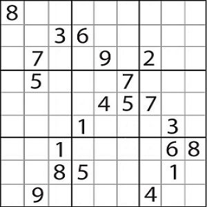
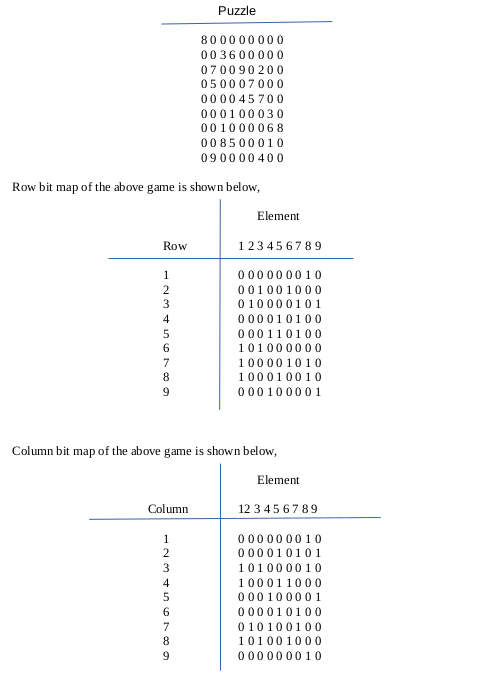
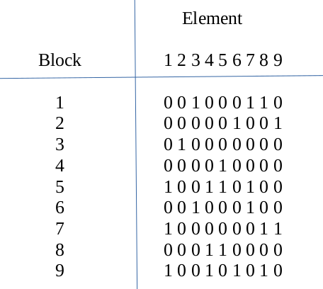
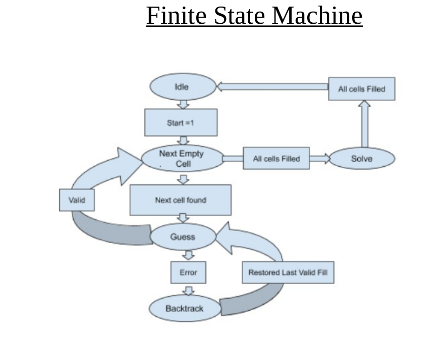

<h1> Sudoku-Solver </h1>

1. A brute force algorithm on hardware is used to solve a sudoku.
2. When a valid fill is not found backtracking is done.
3. Backtracking is repeated until last number is a valid guess i.e guess out of 1 to 9.
4. Digital logic realised using priority encoders and multiplexers.

<h2>Algorithm</h2>

Sudoku contains 81 cells, in a 9×9 grid. Each row, column and block can
contain a series number from 1 to 9.
 
  

Proper Sudokus have one solution. A brute force algorithm can be used to
solve a sudoku on computers. This algorithm visits a cell which is empty and
fill it sequencially till a valid fill is not possible. When a valid fill is not found
then backtracking is done to change a previously alloted sequencial bit to
other number. After writing this new number, the solver again attempts to fill
all empty cell untill further violatoins occur or all cell gets filled. This is
repeated until the allowed value in the last (81st) cell is a valid guess.
Hardest Sudoku: A typical example to run comparative study,

Refernce: https://www.telegraph.co.uk/news/science/science-
news/9359579/Worlds-hardest-sudoku-can-you-crack-it.html

A simple C code is writen to solve sudoku using basic Backtraking problems. A recurisive
function is defined which stacks up untill an end condtion is met. Thus, assigning numbers
to next empty cell found in puzzle before checking if its a vlid entry or not. A simple check
that same entry is not present in its corresponding row, column and block. After checking
the number is assigned and again calling the same assignment function recursively to
satisfy the end test that this assignment would lead to a solution of puzzle or not. If not, try
the next number before checking for its validity.

Hence, simply row and column of unassigned cell and check for conflict from digits one to
nine. If there is no conflict at row column and block, If recursion is successful, return true
but if not, remove the digit assigned and try another. If all digits fail, return false, thus, this
will cause the previous function called in recursion to change the digit it selected then.
Untill all the recursions return true a puzzle is still getting solved. When nill empty cell
left, the puzzle is solved.

  

This methods serves many a advantages. Firstly, it gurantees a solution, however, a user
should enter a valid puzzle. It serves a simple algorithm. But, it takes long time and is
proved to be slow compated to other advanced algorithms. Such an algorithm may
typically require as few as 15,000 cycles, or as many as 900,000 cycles to solve a Sudoku.
Solving a sudoku can also be modelled as a contraint satisfaction problem. 

Reasoning based contraints can be applied to solve as well as model a problem. So, incorporating an algorithm where backtracking and contraint based reasoning would be able to reduce the time to compute and solve all type of sudoku. Following is the above mentioned sudoku game, where zero represents an empty cell.

Bitmaps are used to contraint a validity of an element for a certian cell. Thus, bitmaps represents a constraint that, such elements are already present in a row or column or block. The puzzle is searched for empty cell.

  

When a cell is found, a valid element is evaluated based on candidate selection table defined in the FSM later. Thus, a brute force method could be efficient when combinerd with an elimination method.
<h2>Finite State Machine</h2>

  

When the puzzle is loaded, i.e. start=1, the algorithm starts. FSM will goto next empty state where next emply element is determined. It is a simple logic of priority encoder where forst zero found element’s index are reported as selected row, selected column and selected block. Now, machine
proceeds to guess state.

The above mentioned bitmaps are used to generate the candidate selection table. Every bitmap contains the information that whther a particular cell is occupied (1) or empty (0). This information about which element are yet to be occupied in a parttcular row, column and block is fed to a
priority encoder. 

Randomly selecting a number would make it difficult to backtrack as then we have to keep a track of it. Also, first number which will always be the least vlaid number which can be filled onto that cell can be used. It would help in creating logic for backtracking as will be explained
further as FSM proceeds. 

In the above example, the first empty cell was (1,2) thus making
candidate selection table for first row, second column and first block.

This represents that 1,2,4 and 6 are valid elemnets which can be filled. As mentioned earlier, selecting 1 as valid element FSM proceeds further. When this cell is filled, its bitmaps are also updated correspondingly. Also, this element and its address loaction is filled onto the stack to remember which element was filled where. This process of finding empty cells and filling repeats untill sudoku completes or some violation occurs. When a violation occurs, means that candidate slection table cannot find any zero entry in it. Thus, we need to backtrack and check for the last
filled cell. It is backtracked by poping a value from stack where its address was stored. 

This particular address is read and its element is stored. It’s loaction is cleared and again bitwise ORing test of bitmaps is done to find the valid elements which can be filled. Now a valid symbol other than the one which was already put in it is selected. Thus, next larger element thna the one restored from stack is selected from valid list and further filling of puzzle proceeds. Eventually algorithm fills in the last empty cell.

Example Sudoku Under Test:

  
  
  
<h1>Comparision</h1>
Thus, 19.811 micro-seconds took for VHDL code to solve sudoku. Clock Time peroid was 100 pico second.

For 2.3GHz, 138,690,000 clock cycles are used up by code. However, 198,114 clock cycles used by VHDL.

If clock were 2.3GHz for VHDL, then time taken would be, 86 micro-sec which is less than 60.3 milli-sec as in C code backtracking.

Goto [Report](https://github.com/sourabh-suri/Sudoku-Solver/blob/master/Sudoku_Solver/Report.pdf) for all details.....
